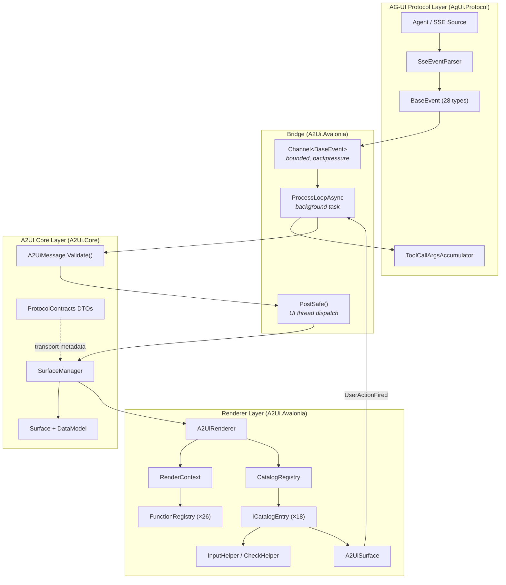
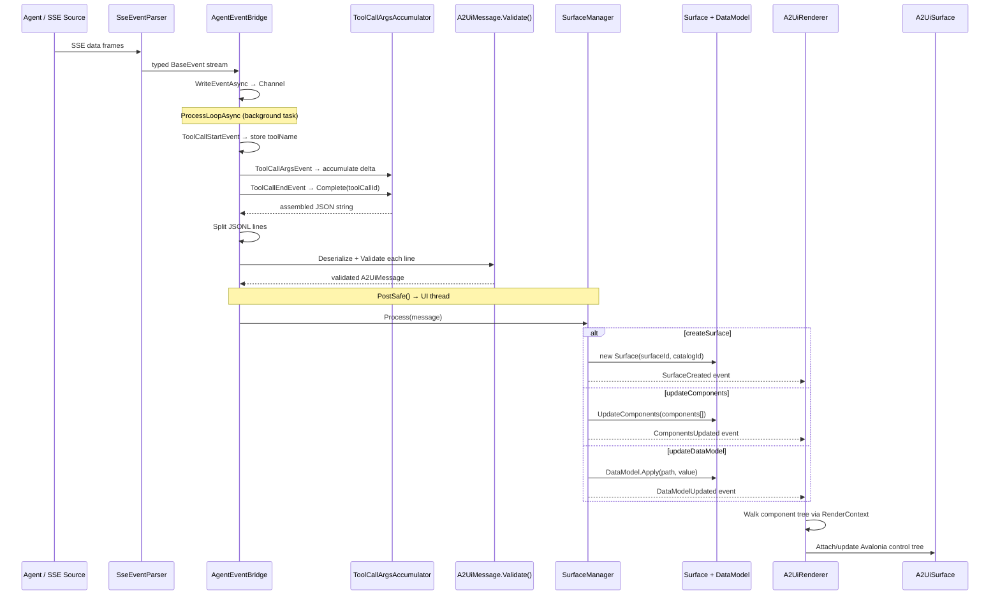
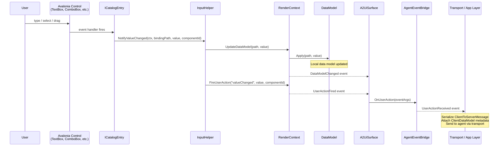
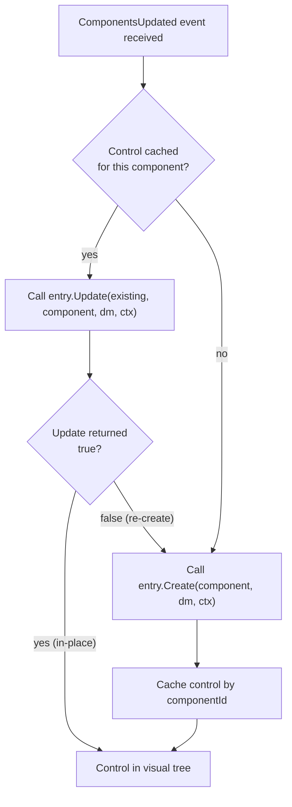
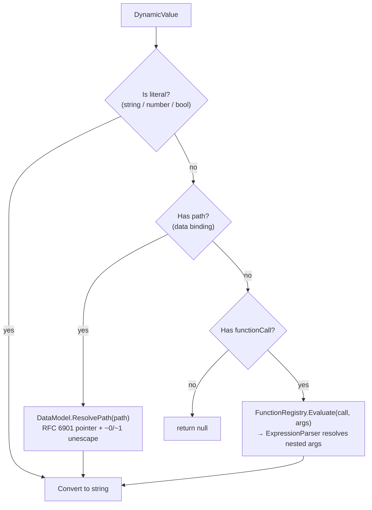
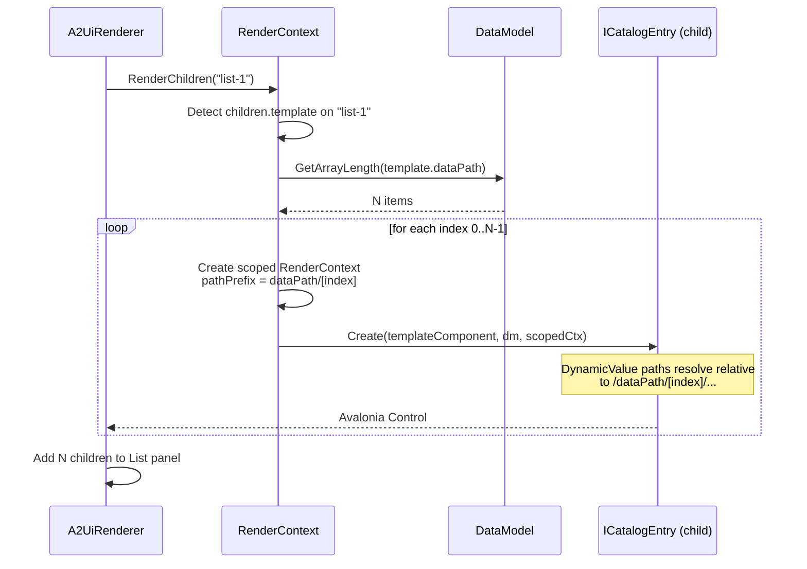

# .NET/Avalonia A2UI Implementation — Status & Architecture

**Protocol version:** v0.9  
**Branch:** `feature/dotnet-avalonia-renderer`  
**Runtime:** .NET 10 (`global.json` pins SDK 10.0.100)  
**Last updated:** 2026-04-07  
**Status:** Feature-complete for intended v0.9 baseline scope

---

## 1. Purpose

This document is the primary reference for the .NET/C# implementation of the
[A2UI](https://github.com/google/A2UI) (Agent-to-UI) and AG-UI protocols.
It serves as both a status tracker and an architecture overview — a single place
to understand what is built, what is deferred, and why.

The implementation provides a complete v0.9 rendering pipeline: from AG-UI agent
events through A2UI message processing to Avalonia desktop controls.

---

## 2. Solution Structure

**Solution file:** `A2Ui.slnx` (7 projects, 38 hand-authored source files)

| Project | Path | Purpose |
|---------|------|---------|
| `AgUi.Protocol` | `agent_sdks/dotnet/src/AgUi.Protocol/` | AG-UI 28-event type model, SSE parser, tool-call accumulator |
| `A2Ui.Core` | `agent_sdks/dotnet/src/A2Ui.Core/` | A2UI message model, envelope validation, surface state, data model, protocol DTOs |
| `A2Ui.Avalonia` | `renderers/avalonia/src/A2Ui.Avalonia/` | Avalonia renderer: 18 catalog entries, function registry, bridge |
| `AgUi.Protocol.Tests` | `agent_sdks/dotnet/tests/AgUi.Protocol.Tests/` | Event serialization, SSE parser tests |
| `A2Ui.Core.Tests` | `agent_sdks/dotnet/tests/A2Ui.Core.Tests/` | Message, validation, data model, surface manager tests |
| `A2Ui.Avalonia.Tests` | `renderers/avalonia/tests/A2Ui.Avalonia.Tests/` | Headless renderer, catalog entry, integration, bridge tests |
| `A2Ui.Avalonia.Gallery` | `samples/client/avalonia/gallery_v0_9/` | Offline spec-example replay harness |

**Shared build settings** (`Directory.Build.props`): `Nullable: enable`, `TreatWarningsAsErrors: true`, `LangVersion: latest`, Roslynator + NetAnalyzers enabled.

---

## 3. Protocol Coverage

### 3.1 AG-UI Events (28/28)

All 28 AG-UI event discriminators are modeled as `sealed record` types with
`[JsonDerivedType]` polymorphism on `BaseEvent`. No external dependencies
beyond `Microsoft.Extensions.Logging.Abstractions`.

| Category | Events |
|----------|--------|
| Lifecycle | `RUN_STARTED` `RUN_FINISHED` `RUN_ERROR` `STEP_STARTED` `STEP_FINISHED` |
| Text | `TEXT_MESSAGE_START` `TEXT_MESSAGE_CONTENT` `TEXT_MESSAGE_END` `TEXT_MESSAGE_CHUNK` |
| Tool | `TOOL_CALL_START` `TOOL_CALL_ARGS` `TOOL_CALL_END` `TOOL_CALL_RESULT` `TOOL_CALL_CHUNK` |
| State | `STATE_SNAPSHOT` `STATE_DELTA` `MESSAGES_SNAPSHOT` `ACTIVITY_SNAPSHOT` `ACTIVITY_DELTA` |
| Reasoning | `REASONING_START` `REASONING_MESSAGE_START` `REASONING_MESSAGE_CONTENT` `REASONING_MESSAGE_END` `REASONING_MESSAGE_CHUNK` `REASONING_END` `REASONING_ENCRYPTED_VALUE` |
| Extension | `RAW` `CUSTOM` |

Supporting infrastructure:
- `SseEventParser` — async SSE stream reader with reconnection logging
- `ToolCallArgsAccumulator` — reassembles multi-part `TOOL_CALL_ARGS` deltas

### 3.2 A2UI Messages

**Server → Client (4/4):** `createSurface`, `deleteSurface`, `updateComponents`, `updateDataModel`

**Client → Server (2/2):** `action`, `error`

Both directions enforce envelope validation via `Validate()`:
- `A2UiMessage`: requires `version = "v0.9"` + exactly one operation (`oneOf` from `server_to_client.json`)
- `ClientToServerMessage`: requires `version = "v0.9"` + exactly one of action/error

### 3.3 Transport Metadata DTOs

These flow through transport initialization/metadata (A2A, MCP), not as A2UI surface operations:

| Type | Schema | Fields |
|------|--------|--------|
| `ServerCapabilities` | `server_capabilities.json` | `supportedCatalogIds`, `acceptsInlineCatalogs` |
| `ClientCapabilities` | `client_capabilities.json` | `supportedCatalogIds`, `inlineCatalogs` (raw JSON) |
| `ClientDataModel` | `client_data_model.json` | `version`, `surfaces` (surfaceId → JSON data model) |

### 3.4 Data Model

`DataModel` provides per-surface JSON state with:
- RFC 6901 JSON Pointer resolution (with `~0`/`~1` unescaping)
- `DynamicValue` resolution — literals (string/number/bool/array), data bindings, function calls
- Set/delete at arbitrary paths with intermediate node auto-creation
- Array index access, auto-expansion, and length queries

---

## 4. Renderer

### 4.1 Catalog (18/18 v0.9 components)

| Category | Components |
|----------|------------|
| Display | `Text` `Image` `Icon` `Video`* `AudioPlayer`* `Divider` |
| Layout | `Row` `Column` `List` `Card` `Tabs` `Modal` |
| Interactive | `Button` `TextField` `CheckBox` `ChoicePicker` `DateTimeInput` `Slider` |

*Video/AudioPlayer are text placeholders — Avalonia has no native media controls.

**Extension point:** `CatalogRegistry` maps type strings → `ICatalogEntry` implementations.
Each entry provides `Create()` (initial render) and `Update()` (in-place refresh).

### 4.2 Component Capabilities

| Capability | Details |
|------------|---------|
| Button variants | `default`, `primary`, `danger`, `borderless` (CSS class-based) |
| ChoicePicker | `mutuallyExclusive` → ComboBox; `multipleSelection` → ListBox+CheckBox or WrapPanel+ToggleButton. Supports `filterable` (AutoCompleteBox) and `displayStyle` (checkbox/chips) |
| Input write-back | All inputs use `InputHelper.NotifyValueChanged()` — updates data model then fires action |
| In-place updates | TextField, CheckBox, Slider, DateTimeInput, ChoicePicker (ComboBox). All focus-guarded |
| Check validation | `CheckHelper.ApplyChecks()` evaluates conditions on all inputs |
| Divider axis | Horizontal (default) and vertical orientations |
| Template expansion | `List` with `children.template` iterates data model arrays with scoped paths |

### 4.3 Functions (26 built-in)

`FunctionRegistry.CreateDefault()` registers:

| Group | Functions |
|-------|-----------|
| Formatting | `capitalize` `formatNumber` `formatCurrency` `formatDate` `formatString` `pluralize` |
| Arithmetic | `add` `subtract` `multiply` `divide` |
| Comparison | `equals` `not_equals` `greater_than` `less_than` |
| Logical | `and` `or` `not` |
| String | `contains` `starts_with` `ends_with` |
| Validation | `required` `email` `regex` `length` `numeric` |
| Action | `openUrl` |

---

## 5. Actors & Components

### 5.1 Component Roles

The implementation is organized around distinct actors, each owning a specific
responsibility in the protocol pipeline. The table below maps each C# class to
its role in the AG-UI / A2UI processing chain.

| Actor | Class | Layer | Responsibility |
|-------|-------|-------|----------------|
| **SSE Parser** | `SseEventParser` | `AgUi.Protocol` | Reads SSE frames from an HTTP stream, emits typed `BaseEvent` objects. Handles reconnection and malformed frames. |
| **Event Type Model** | `BaseEvent` + 28 derived records | `AgUi.Protocol` | Strongly-typed AG-UI events with `[JsonDerivedType]` polymorphic deserialization. |
| **Tool-Call Accumulator** | `ToolCallArgsAccumulator` | `AgUi.Protocol` | Concatenates `TOOL_CALL_ARGS` deltas by `toolCallId` until `TOOL_CALL_END` completes them. |
| **Envelope Validator** | `A2UiMessage.Validate()`, `ClientToServerMessage.Validate()` | `A2Ui.Core` | Enforces protocol envelope constraints: version required, exactly-one-operation. |
| **Surface Manager** | `SurfaceManager` | `A2Ui.Core` | Manages surface lifecycle (create/delete) and applies component/data-model updates. Thread-safe via lock; events fired outside lock. |
| **Surface** | `Surface` | `A2Ui.Core` | Per-surface state container: component map, data model, theme, sendDataModel flag. |
| **Data Model** | `DataModel` | `A2Ui.Core` | Per-surface JSON state store. Resolves `DynamicValue` paths, applies RFC 6901 pointer operations. |
| **Protocol DTOs** | `ServerCapabilities`, `ClientCapabilities`, `ClientDataModel` | `A2Ui.Core` | Serialization contracts for transport-layer metadata exchange. |
| **Agent Event Bridge** | `AgentEventBridge` | `A2Ui.Avalonia` | Connects AG-UI events to the rendering pipeline. Owns the async channel, background processing loop, and UI-thread dispatch. |
| **Catalog Registry** | `CatalogRegistry` | `A2Ui.Avalonia` | Maps component type strings to `ICatalogEntry` implementations. Extensible via `Register()`. |
| **Catalog Entries** | 18 `ICatalogEntry` implementations | `A2Ui.Avalonia` | Each entry creates and updates one Avalonia control type from an `A2UiComponent`. |
| **Render Context** | `RenderContext` (implements `IRenderContext`) | `A2Ui.Avalonia` | Scoped rendering environment: resolves `DynamicValue`, renders children/templates, fires user actions, writes data model updates. |
| **Function Registry** | `FunctionRegistry` | `A2Ui.Avalonia` | Maps function names to evaluation delegates (26 built-in). Used by `ExpressionParser` during `DynamicValue` resolution. |
| **Input Helper** | `InputHelper` | `A2Ui.Avalonia` | Shared write-back pattern: updates data model then fires `valueChanged` action. Used by all input catalog entries. |
| **Check Helper** | `CheckHelper` | `A2Ui.Avalonia` | Evaluates `CheckRule` conditions and renders validation messages on input controls. |
| **Renderer** | `A2UiRenderer` | `A2Ui.Avalonia` | Orchestrates rendering: walks component tree, delegates to catalog entries via render context, caches controls for in-place updates. |
| **Surface Control** | `A2UiSurface` | `A2Ui.Avalonia` | Avalonia `UserControl` that hosts the rendered tree. Bridges user interactions back to `AgentEventBridge`. |

### 5.2 Pipeline Diagram



### 5.3 Threading Model

| Thread | Owner | Work |
|--------|-------|------|
| Agent / caller thread | External | Writes `BaseEvent` to the bounded channel via `WriteEventAsync` |
| Background task | `AgentEventBridge.ProcessLoopAsync` | Reads channel, accumulates tool-call deltas, deserializes JSONL, validates messages |
| UI thread | `AgentEventBridge.PostSafe` → Avalonia dispatcher | Executes `SurfaceManager.Process()`, renderer updates, event handler callbacks |

**Safety guarantees:**
- `PostSafe()` wraps all dispatcher lambdas in try-catch — subscriber exceptions cannot crash the app
- `SurfaceManager` acquires lock for state mutation, fires events outside lock to prevent deadlocks
- Dropped operations (unknown surfaceId, duplicate create) and root absence are logged at warning level
- Malformed JSONL payloads are logged and skipped; bridge continues processing

### 5.4 Agent Event → Surface Update Flow

The primary data path: an agent sends AG-UI events that ultimately create or
update a rendered surface.



### 5.5 UI Write-Back Path

When the user interacts with an input control, the value flows back through the
data model and out as a client-to-server action.



### 5.6 Component Rendering Lifecycle

How the renderer decides between creating a new control and updating an existing one.



**In-place update support by component:**

| Supports `Update() → true` | Always re-creates (`Update() → false`) |
|----|-----|
| TextField, CheckBox, Slider, DateTimeInput, ChoicePicker (ComboBox), Text, Icon, Divider, Image | Button, Card, Tabs, Modal, Row, Column, List, Video, AudioPlayer, ChoicePicker (multi-select/filterable) |

### 5.7 DynamicValue Resolution

How `RenderContext.Resolve()` turns a `DynamicValue` into a concrete string
used by catalog entries for labels, text, bound values, etc.



### 5.8 Template Expansion (List Component)

How `List` with `children.template` renders one child per data model array item.



---

## 6. Design Decisions

These are conscious choices, not unaddressed gaps. Each was evaluated during
code review and accepted with rationale.

| Decision | Rationale |
|----------|-----------|
| `DynamicValue` union covers `DynamicBoolean`/`DynamicString`/etc. | The spec's `DynamicBoolean` is a schema constraint, not a distinct runtime type. One union type handles all shapes correctly. |
| No chunk-event expansion helper | No reference implementation (Python, Java, Lit, Angular) provides this. Chunk events deserialize correctly; expansion is consumer-side. |
| No `sendDataModel` packaging in Core | Core stores the flag; packaging depends on transport (A2A, MCP). Belongs in Shell/transport layer. |
| Permissive `GetRootComponents()` fallbacks | Supports incremental loading and backward compatibility. Root absence is surfaced via warning log, not rejection. |
| ChoicePicker multi-select returns `false` from `Update()` | ComboBox variant updates in-place. Multi-select/filterable variants re-create due to state sync complexity. Acceptable trade-off. |
| `CultureInfo.GetCultureInfo("en-US")` with fallback | FormatNumber/FormatCurrency target en-US formatting. Falls back to InvariantCulture in globalization-invariant mode (Docker, trimmed apps). |

---

## 7. Verification

### Build & Test

```bash
dotnet build A2Ui.slnx --configuration Release
dotnet test A2Ui.slnx --configuration Release
```

### Requirement Traceability

| Requirement | Implementation | Test Evidence |
|-------------|---------------|---------------|
| AG-UI 28 event discriminators | `BaseEvent.cs` (28 `[JsonDerivedType]`) | `EventSerializationTests.cs` |
| A2UI server envelope validation | `A2UiMessage.Validate()` | `A2UiMessageTests.cs` |
| A2UI client envelope validation | `ClientToServerMessage.Validate()` | `A2UiMessageTests.cs` |
| 18/18 catalog components | `CatalogRegistry.CreateDefault()` | `CatalogRegistryTests.cs` + integration tests |
| RFC 6901 JSON Pointer escaping | `DataModel.SplitPath()` | `DataModelTests.cs` |
| Bridge E2E tool-call → surface | `AgentEventBridge` | `AgentEventBridgeTests.cs` |
| Protocol negotiation DTOs | `ProtocolContracts.cs` | `ProtocolContractsTests.cs` |

---

## 8. Review History

| Date | Review | Outcome |
|------|--------|---------|
| 2026-04-07 | Initial review | 11 findings: 9 implemented, 3 disagreed with rationale |
| 2026-04-07 | Re-review | 7 findings: 5 implemented, 2 accepted as deferred-by-design |
| 2026-04-07 | Final verification | All remediations verified; feature-complete for v0.9 scope |

---

## 9. Future Work

| Priority | Item | Notes |
|----------|------|-------|
| Next | **Shell client** | Agent-connected round-trip over A2A transport (see `RESTAURANT_DEMO_PORT_PLAN.md`) |
| Next | **Transport bindings** | Wire `ProtocolContracts` DTOs into A2A AgentCard / MCP initialization |
| Later | **v0.10 review** | Evaluate `specification/v0_10/` when draft stabilizes |
| Later | **Media controls** | LibVLCSharp or similar for Video/AudioPlayer |
